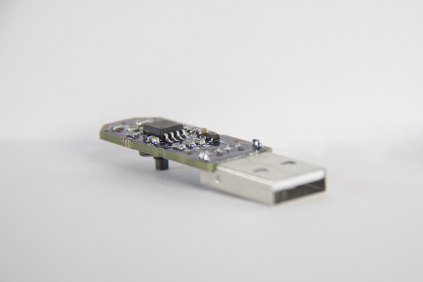
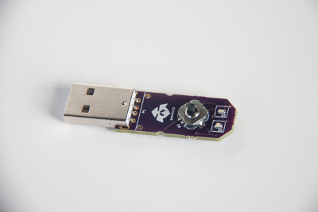
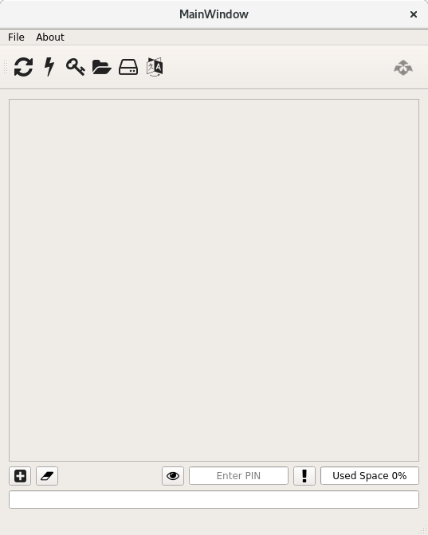

= MemType Documentation
area0x33 <info@area0x33.com>
:icons: font
:experimental:
:toc: right

[IMPORTANT]
====
*This documentation is under active development and discussion!*

If you find errors or omissions in this document, please don't hesitate to 
https://github.com/jim17/memtype/issues/new[submit an issue] or open a pull
request with a fix. We also encourage you to ask questions and discuss any 
aspects of the project by mailto:info@area0x33.com[email].
====

[.text-center]
 

Welcome to the MemType documentation, here you'll learn everything about the 
MemType hardware, firmware, software tools and usage for any user level.

If you fancy one, you can get it from our 
https://www.tindie.com/stores/area0x33/[tindie store]!

== Introduction

[.text-center]
 

Technically speaking the MemType is an open source `hardware password keeper`.
This means it is basically a device focused in securely `storing passwords`.
The `open source` part means that we share all the
software source files, hardware design files and documentation under the
<<License>> conditions.

Having the passwords stored in a password keeper has several advantages:

* No reusing same pass in different apps or webs.
* More secure and long passwords can be used, no need to remember them.
* No more forgotten passwords.

We like hardware password keepers but we couldn't find one that satisfied our
usability needs, also they were very expensive! That's why we decided to make
the MemType `loaded with features` and with a `reduced BOM` that results in a 
simple `low cost` device that's also great for `DIY makers` and `hackers`.

=== MemType features

* `Encrypted storage` in the device using https://en.wikipedia.org/wiki/NOEKEON[NOEKEON] written
in pure assembler!
* `AES encrypted backups` on the PC using the <<MemTypeTool GUI>>.
* Plug it into a `USB`, `no drivers or software for using it`.footnote:[Using it doesn't require 
software or drivers. For managing operations like storing credentials or changing 
the PIN the MemTypeTool is needed and depending on the OS the libusb driver.]!
Works as a HID keyboard.
* `Works anywhere!`. While others only work on webs or certain 
apps, the MemType can be used anywhere from webs, apps, terminals or anywhere 
it's allowed to type using a keyboard.
* `One click login`. It stores and `types for you` not only the `password` but
also the `user` without any interaction from your part, and it also submits it!
* Add `delays` to `enter the password when it's asked`, for example in `ssh` or
login forms where the user and password are asked in two steps.
* `Dynamic storage`. You're `not limited` to a certain number of credentials, 
just fill the 2KB storage with them.
* `Assign names` to the credentials so you can find them easy and fast to use them.
* Manage the device with the <<MemTypeTool GUI>> software, super easy and simple!
* `Truly multiplatform`. The MemType works on `any device with usb` keyboard 
capability like tablets, smart tv, and phones.
* `Any keyboard layout`. Load the keyboard layout you've got working in your OS 
using the <<MemTypeTool GUI>>. 
* `Truly Open Source` Software and Hardware.

=== Credentials

The data structure used by the MemType to store `passwords` and `usernames` is
called a `credential`. Appart from passwords and usernames it also stores a
field that stores the key combination to move from the user input to the
password input, called `hop`. It also includes a field for storing the key
combination to submit the login form or command, called `submit`. To help you
find the credential you need, each of them has a name stored in the `name`
field.

[cols="1,6", options="header"] 
|===
|Field
|Description

|*name*
|The name that'll be shown while using the device.

|*user*
|The username of the login.

|*hop*
|The sequence of keyboard keys to move from the user input field to the password one. Usually kbd:[tab], sometimes kbd:[Enter]

|*password*
|The password that'll be typed into the password input field.

|*submit*
|The sequence of keyboard keys to validate the login. Usually kbd:[Enter].
|===

When a `credential` is applied, the MemType generates the key sequence like you 
were typing it into your keyboard, excluding the name by the order of the table above.

In a login form, you focus the username field and then move the MemType joystick
kbd:[up] and kbd:[down] looking for the credential you need. When you find the 
right credential, kbd:[enter] to apply it and the MemType will erase the credential
name, type the username, move to the password input field, type it and submit. All
this process is done much times faster than any person can type.

There are some cases where you may need a `delay` in a certain point, for example
when the login form asks for the user, validates it and then asks for the password.
Such delays can be made by the MemType using one special character when editing
the credential. This and more is explained in the <<Advanced uses>> section. 

It's easy to see how this credential structure can be used to `securely store` and
type other kind of data like commands or `credit card numbers`.

When buying online
it's faster and more secure to let the MemType type the credit card number than pulling
out the creditcard with the number printed on it. 

A way of accomplishing it would be by having all the fields empty except
the `password` field that would contain the `credit card number` and the name. 

=== Links

=== N_O_D_E Video review

If you want a great video introduction and review of the MemType, check the
following awesome video made by
https://www.youtube.com/channel/UCvrLvII5oxSWEMEkszrxXEA[N_O_D_E].

[.text-center]
video::O16U_TjAutU[youtube, width="800",height="500"]

=== Compare to others password keepers

== Quick start

Open a `text editor` and connect the MemType to the `USB` port of your computer. 
You'll see the `red led` icon:circle[role="red"] turning on indicating it's being 
`powered` correctly and it's `locked`.

On the text editor it will write a `welcome message` indicating it's firmware
version:

	MemType 3.2.0

You don't have to delete what it writes, it deletes it's own text to write new
one, `that's how the MemType communicates with you`.
Now you can unlock it entering the `PIN`, by default it's `0000`. To enter the PIN
use the `joystick`: 

* up icon:arrow-up[] increases the number. 
* down icon:arrow-down[] decreases.
* towards the connector icon:arrow-right[] accepts the number.
* the opposite joystick movement icon:arrow-left[] to cancel. 

We'll refer to these movements
kbd:[up], kbd:[down], kbd:[enter] and kbd:[back] respectively.

You should have now the pin entered:

	PIN: 0000

One more kbd:[enter] and it'll validate and show the name of the first credential
and the green led icon:circle[role="green"] will be on.
If the PIN is incorrect an error message will be displayed:

	PIN ERR

The MemType comes preloaded with 3 dummy credentials so you can play the first
time. Move kbd:[up] and kbd:[down] to see their names, apply one with the
kbd:[enter] movement on the joystick, see the details with one kbd:[back] 
movement and lock the device with one more kbd:[back] movement (2 in total) 
turning the red led icon:circle[role="red"] on again.

That's the basic usage of the MemType, now to be useful it has to contain the
credentials you'll use, setup a *different PIN*, and be loaded with the same
`keyboard layout` as your operating system or you'll see strange characters. To do
all this management on the device there is an easy to use Graphical User
Interface software called <<MemTypeTool GUI>>.

== MemTypeTool GUI
[.text-center]
 

The MemTypeTool GUI can be downloaded from :
https://github.com/oyzzo/MemTypeTool

It is developed using C++ , Qt5, and libusb. There is a `precompiled binary` release
available for `Linux`. In case you use other operating system, there is a linux
virtual machine `image` ready to run in `VirtualBox`.

=== Linux installation (binary release)

Download the binary release compressed file, extract it and run:

	wget https://github.com/oyzzo/MemTypeTool/releases/download/1.0.1/MemTypeTool-1.0.1-linux_x64.tar.gz
	tar xvf MemTypeTool-1.0.1-linux_x64.tar.gz
	cd linux64
	./MemTypeManager.sh

In order to have access to the USB devices from an
unprivileged user:

	wget https://raw.githubusercontent.com/oyzzo/MemTypeTool/master/99-MemType.rules	
	sudo mv 99-MemType.rules /etc/udev/rules.d/
	reboot

=== Windows, macOS and others (VirtualBox Image)

* Download the VirtualBox image from https://github.com/oyzzo/MemTypeTool/releases/download/1.0.1/Lubuntu.17.04.64bit.vmdk.7z

* Extract it using 7-Zip or similar (keka in macOS).

* Install VirtualBox and Extensions from www.virtualbox.org.

* Create a new Linux 64 bits virtualbox machine.

* When asked for the drive, choose the extracted vmdk file.

* Run the virtual Machine and add the memtype device to it.

* Run the MemTypeTool from the desktop.

=== Usage

TIP: You can use the `bottom input text` to communicate with your memtype, `focusing
it` with a mouse click if it's not already focused.

[.text-center]
video::unlock.mp4[]

==== Setting the keyboard layout

Using the GUI you can change the `MemType keyboard layout` to match your `computer
keyboard layout`. The current available layouts files are located under `keyboard
directory`.

[.text-center]
video::setkeyboard.mp4[]

==== Setting the P.I.N.

WARNING: `Changing the default PIN` is a very important action that `should be done as soon
as possible` before loading any credential into de MemType.

[.text-center]
video::setpin.mp4[]

==== Reading from device

You can `read the credentials from the MemType` to do any action to them and write
them back, or make an `encrypted` file `backup` by <<Exporting encrypted file>>.

[.text-center]
video::read.mp4[]

==== Writting to device

When you've got everything looking OK in the MemTypeTool GUI you have to `write
the credentials` to the MemType device so you can use them.

Another option would be to simply store them by <<Exporting encrypted file>>.

[.text-center]
video::write.mp4[]

==== Adding credentials

Adding credentials is easy, when you've got your new credentials created
remember <<Writting to device>>.

[.text-center]
video::add.mp4[]

==== Editing credentials

Editing is essential, edit to have your passwords in the credentials, usernames and any other field
so you can forget them!

[.text-center]
video::edit.mp4[]

==== Deleting credentials

Delete by clicking into the `bin icon` of any credential. The `changes` will not
take effect until you `write` to the device.

[.text-center]
video::delete.mp4[]

==== Exporting encrypted file

You can have backups in your computer, or have one AES encrypted file containing all
the credentials for a given user role in your company. 

WARNING: Don't forget the file
password or there'll be no way of getting back the credentials from that file.

[.text-center]
video::export.mp4[]

==== Importing from encrypted file

As easy as exporting, enter the file password and your credentials will be ready
to be edited.

[.text-center]
video::import.mp4[]

==== Adding delays to credentials

== Using the MemType

=== P.I.N. Unlock

=== Use a credential

=== Credential details

=== Lock the device

=== Advanced uses

== MemType library

The MemType library (`libsmttool`) is a `python library` that allows
`communication`
with the MemType in python. It allows all the operations that can be realized
with the MemTypeTool GUI as it's based on libsmttool. 

It can be found in this github:
https://github.com/oyzzo/MemTypeTool/tree/master/libsmttool.

It also can be found under the `libsmttool` directory when downloading the 
MemTypeTool GUI.
https://github.com/oyzzo/MemTypeTool/archive/master.zip

It's composed of two modules, the `noekeon.py` file and the `memtype.py` file.

[NOTE]
=====
This library depends on: 

* python2.7
* libusb-1.0-0
* pyusb
=====

=== noekeon.py

As the memtype uses internally the noekeon algorithm for encrypting the
credentials, this algorithm has to be used in the MemTypeTool GUI to decrypt
them back.

This file provides a python implementation based on the
http://gro.noekeon.org/Noekeon-spec.pdf[noekeon specification].

NOEKEON is an iterated block cipher with a block and key length of 128 bits.

The public methods implemented in the library are:

=====
 . *NoekeonEncrypt(WorkingKey, State)*
 . *NoekeonDecrypt(WorkingKey, State)*
=====

The Number of Rounds is defined by `NUMBER_OF_ROUNDS` and fixed to `16`.

*WorkingKey* format is 4 elements of 32 bit length each.

*State* is the information to be encrypted / decrypted in `4 elements of 32
bit`.

=== memtype.py

MemType command library implementation.

Public methods implemented in `memtype.py` file:

=====
. *memtype Class* Communicates with the device.
.. *connect* Open USB connection with device.
.. *disconnect* Close USB connection with device.
.. *info* Read info from device and return deviceInfo object.
.. *write* Write credentials to memtype credential reserved memory area,
credential data must be encrypted with the right PIN.
.. *read* Read credentials from memtype, must be decrypted with the right PIN.
.. *writePinHash* Writes PIN hash into memtype, *pinToHas* function can be used
to generate the hash.
.. *readPinHash* Reads the PIN hash from the memtype.
.. *writeKeyboardLayout* Writes a keyboard layout into the memtype device.
.. *isLocked* Returns TRUE if the memtype has not been unlocked with PIN.
.. *validatePin* When the memtype is unlocked, checks if a PIN corresponds to
the PIN hash and returns TRUE, FALSE otherwise.
. *decryptCredentialList(cl, key)* Decrypts a credential list according to device
implementation.
. *encryptCredentialList(cl, key)* Encrypts a credential list according to
device implementation.
=====

== Hardware

=== PCB

=== BOM

== Firmware

== License

== F.A.Q.

[qanda]
Can I make a MemType myself?::
	Yes! It's a great DIY project!. 
	You can make your PCB using the design files or order one from
	OSHpark, buy the components, solder them, compile the firmware and burn
	it into the microcontroller!

How many credentials can be stored?::
	The capacity of the credentials storage on the MemType is `2KB`.
	Credentials are stored dinammically so `it'll depend on the length` of the
	name, username, password etc...

Can I make a backup of my credentials?::
	Having a backup of the credentials is always a good idea. You can export
	an encrypted file from the `MemTypeGUI` containning all your
	credentials.
