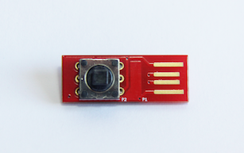

= MemType Documentation
area0x33 <info@area0x33.com>
:icons: font
:data-uri:
:toc: right

[IMPORTANT]
====
*This documentation is under active development and discussion!*

If you find errors or omissions in this document, please don't hesitate to 
https://github.com/jim17/memtype/issues/new[submit an issue] or open a pull
request with a fix. We also encourage you to ask questions and discuss any 
aspects of the project by mailto:info@area0x33.com[email].
====

[.text-center]
 

Welcome to the MemType documentation, here you'll learn everything about the 
MemType hardware, firmware, software tools and usage for any user level.

If you fancy one, you can get it from our 
https://www.tindie.com/stores/area0x33/[tindie store]!

== Introduction
// TODO Add a license section including license
Technically speaking the MemType is an open source `hardware password keeper`.
This means it is basically a device focused in securely `storing passwords`.
The `open source` part means that we share all the
software source files, hardware design files and documentation under the
<<license>> conditions.

Having the passwords stored in a password keeper has several advantages:

* No reusing same pass in different apps or webs.
* More secure and long passwords can be used, no need to remember them.
* No more forgotten passwords.

We like hardware password keepers but we couldn't find one that satisfied our
usability needs, also they were very expensive! That's why we decided to make
the MemType `loaded with features` and with a `reduced BOM` that results in a 
simple `low cost` device that's also great for `DIY makers` and `hackers`.

=== MemType features

So lets check the main features with a small description:

=== N_O_D_E Video review

If you want a great video introduction and review of the MemType, check the
following awesome video made by
https://www.youtube.com/channel/UCvrLvII5oxSWEMEkszrxXEA[N_O_D_E].

[.text-center]
video::O16U_TjAutU[youtube, width="800",height="500"]

=== Compare to PK1

=== Compare to PK2

=== Compare to PK3

== Quick start

== MemTypeGUI

=== Windows installation

=== Linux installation

=== MacOS installation

=== Usage

==== Setting the keyboard layout

==== Setting the P.I.N.

==== Adding,Editing and Deleting credentials

==== Exporting and importing from file

==== Adding delays to credentials

== Using the MemType

=== P.I.N. Unlock

=== Use a credential

=== Credential details

=== Lock the device

== MemType library

== Hardware

=== PCB
=== BOM

== Firmware

== F.A.Q.
